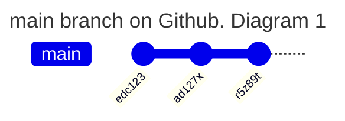
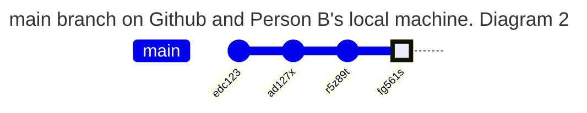
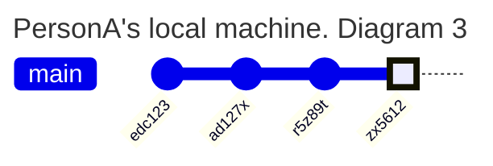
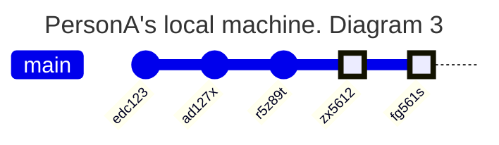
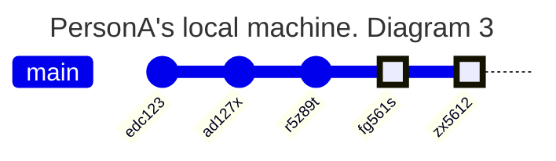

**Very tricky**

2 people (Person A and Person B) are working on a project.
At the moment, the code for their project is hosted on Github.
The `main` branch of the repository on Github looks like this:

Person A and B both clone the repo as it is in Diagram 1.

Person B then commits locally and pushes their work Github. The repo on Github and Person B's machine now looks like this:

Meanwhile, Person A commits on their local machine. Now on Person A's machine they have the following:

What happens now when Person A tries to push their work to Github using Github desktop? Look at the options below:

a) 

The Github repo looks like this:

b) 

The Github repo looks like this:

c) 

The Github repo looks like this:

d) We get an error. 

The most important thing in this question is to try and describe your reasoning/thought process out loud.