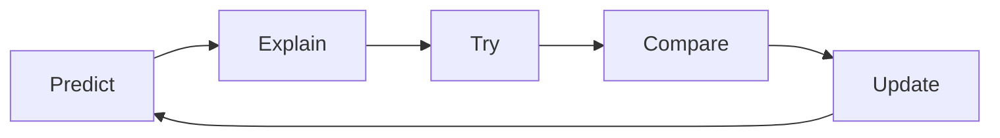

# Asking Questions 101

## Prep

- [ ] Read this article about [Mental Models](https://jamesclear.com/mental-models)
- [ ] Load this webpage, which stores the problems we will work on today. [https://cyf-workshop.netlify.app/asking-questions](https://cyf-workshop.netlify.app/asking-questions)

Today we're going to start learning a formal language of developer questions. We will begin with this basic format:

1. What I _did_
1. What I _expected_
1. What actually _happened_

This format helps to find the discrepancies between expectations and reality. (This is the gap in our understanding.)

It's also an efficient way to share our current understanding with others.

## Expectation vs reality

When we are surprised by an outcome it usually means we had a mental model of the world that didn't predict the world accurately. Don't panic when this happens, it's completely expected for even experienced developers to run into surprises. We use these gaps as signs that we need to _update_ our mental models.

To develop our understanding of coding, we will:

### Predict & Explain

1. Make a _prediction_ by _explaining_ what the outcome will be
1. Play computer - "run" the model in our heads and _predict_ (say before) what the outcome will be

### Try

1. Code up our idea
1. Run the code

### Compare and Update

1. Compare the outcome with our prediction
1. Explain the gap between our prediction and what actually happened
1. Update our understanding

This process is cyclical.

## Updating the _right_ model

If you stuck and can't explain the gap in your mental model, then it's time to ask a question!

When we ask questions, it's important that we share our current mental model as part of your question so that other people can test the right thing, focus on the mis-understanding. Then together you can get quickly to a shared understanding of your specific problem.

Let's look at how asking questions helps you update your mental model with an example.

<!---->

1. Set a [timer for 5 minutes](https://www.google.com/search?q=timer+for+10+minutes).
2. Popcorn around the room and each person give an example of a bad way to ask a question until the timer goes off. For example:

> Argh I can't make it work please help me!

<!---->

### Why are these not useful?

<!---->

1.  Set a [timer for 10 minutes](https://www.google.com/search?q=timer+for+10+minutes).
2.  Popcorn around the room and each person give a reason the previous question was bad until the timer goes off. For example:

> What is _it_? What are you trying to do? In what way is it not working? Be specific! Share what you see. Do you have a link? What do you want it to do?

 <!---->

### Exercise ground rules

Before we get to the next exercise, let's just set some ground rules here:

1. The goal is not to complete the exercise; the goal is to _learn_
1. The smart thing to do is to focus on the questions you cannot (yet) answer

<!---->

Split into groups of 2-5 people.
Set a whole class timer for [30 minutes](https://www.google.com/search?q=timer+for+30+minutes).

### Confound yourselves

- Pick a problem from the [bank](https://cyf-workshop.netlify.app/asking-questions#problem-bank).
- As a group, make a prediction about what you think the answer is, and write it down.
- Test your prediction. Try it out using the dev tools.
- Compare your prediction with the outcome.

What happened? Is there a gap in your understanding?

Keep doing this until you find a problem you can't solve, then write up your mental model using this format:

1. What I _did_
1. What I _expected_. Make sure you include your prediction here
1. What actually _happened_

Include as much context as you can, including links, line numbers, sample code, etc. Use code blocks to mark up your code. If you use screenshots, they should only show the _visual render_ (**never** screenshot code - paste code as text).

Now post your write up of the question in [#cyf-ask-tech-stuff](https://codeyourfuture.slack.com/archives/C59R2722F).

<!---->

### 🧑🏾‍💻🙋 Developer questions contain

1. 🔗 Links 👍
1. Objectives - what are you actually trying to do? 👍
1. 🖼️ Screenshots of UI 👍
1. 📝 `Code blocks` 👍
1. 📷 ~~Screenshots of code~~ 🙅

## 📚 Further reading

- [How to ask](https://stackoverflow.com/help/how-to-ask)
- [The programming duck](https://rubberduckdebugging.com/)
- [Asking Questions](https://curriculum.codeyourfuture.io/guides/asking-questions/)
