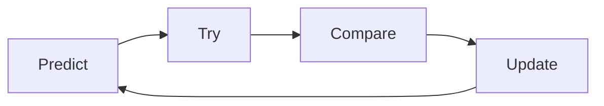

# Asking Questions 101

## Prep

- [ ] Read this article about [Mental Models](https://jamesclear.com/mental-models)
- [ ] Load this webpage, which stores the problems we will work on today. [https://cyf-workshops.netlify.app/asking-questions](asking-questions)

Today we're going to start learning a formal language of developer questions. We will begin with this basic format:

1. What I _did_
1. What I _expected_
1. What actually _happened_

This format helps to find the discrepancies between expectations and reality. (This is the gap in our understanding.)

It's also an efficient way to share our current understanding with others.

## Expectation vs reality

When we are surprised by an outcome it usually means we had a mental model of the world that didn't predict the world accurately. To develop our understanding of coding, we will:

### Predict & Explain

1. Make a _prediction_ by _explaining_ what the outcome will be
1. Play computer - "run" the model and _predict_ (say before) what the outcome will be

### Try

1. Code our model
1. Run the code

### Compare and Update

1. Compare the outcome with our prediction
1. Explain the gap between our prediction and what actually happened
2. Update our understanding

This process is cyclical.

## Updating the _right_ model

When we ask questions, we need to share our perspective with others so together we can test the right thing, focus on the mis-understanding or mistake, and get quickly to a shared understanding of your specific problem. Let's look at an example.

<!---->

1. Set a [timer for 5 minutes](https://www.google.com/search?q=timer+for+10+minutes).
2. Popcorn around the room and each person give an example of a bad way to ask a question until the timer goes off. For example:

> Argh I can't make it work please help me!

<!---->

### Why are these not useful?

<!---->

1.  Set a [timer for 10 minutes](https://www.google.com/search?q=timer+for+10+minutes).
2.  Popcorn around the room and each person give a reason the previous question was bad until the timer goes off. For example:

    > What is _it_? What are you trying to do? In what way is it not working? Be specific! Share what you see. Do you have a link? What do you want it to do?

    <!---->

### Let's just set some ground rules here:

1. The goal is not to complete the exercise; the goal is to _learn_
1. The smart thing to do is to focus on the questions you cannot (yet) answer

<!---->

Split into groups of 2-5 people.
Set a whole class timer for 30 minutes.

### Confound yourselves

- Pick a problem from the bank.
- As a group, make a prediction about what you think the answer is, and write it down.
- Test your prediction. (Try it out.)
- Compare your prediction with the outcome.

What happened? Is there a gap in your understanding?

- Keep doing this until you find a problem you can't solve.
- When you find a problem you can't solve, write it up using the format:

1. What I _did_
1. What I _expected_
1. What actually _happened_

Put your prediction in the "expected" section.

Include as much context as you can, including links, line numbers, sample code, etc. Use code blocks to mark up your code. If you use screenshots, they should only show the _visual render_ (never screenshot code).

Post your question in #cyf-ask-tech-stuff.

### 🧑🏾‍💻🙋 Developer questions contain

1. 🔗 Links 👍
1. 🖼️ Screenshots of UI 👍
1. 📝 `Code blocks` 👍
1. 📷 ~~Screenshots of code~~ 🙅

<!---->

## 📚 Further reading

- [How to ask](https://stackoverflow.com/help/how-to-ask)
- [The programming duck](https://rubberduckdebugging.com/)
- [Asking Questions](https://curriculum.codeyourfuture.io/guides/asking-questions/)
