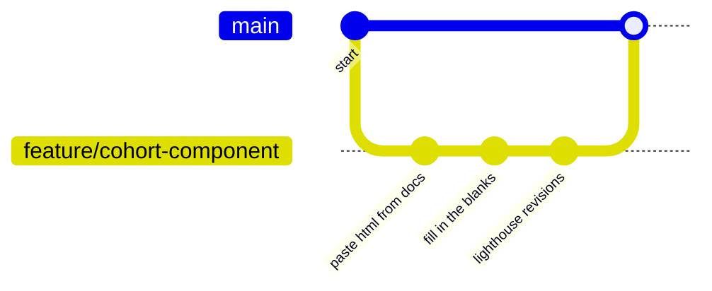

# Components are Functions

Today we're going to think some more about components. We're going to build a page using a design system and we're going to collaborate on a feature branch workflow. We're going to identify the difference between HTML and the DOM using Devtools. And we're going to create new DOM nodes using JavaScript functions. Oh my goodness, it's so many things! That's why it's best to do this workshop after you've done:

- [x] [HTML-CSS]()
- [x] [JS1]()
- [x] [JS2]()

And in particular, these workshops:

- [Git]()
- [Devtools]()
- [Asking Questions]()
- [Components 101]()

The overall mission is to compose "components" / groupings of HTML elements to re-build this web page: [CYF Components Workshop](https://cyf-workshops.netlify.app/components-2).

But this time, we're going to use JavaScript functions to build our components.

## Learning Objectives

```objectives
- [ ] Import a function from a module
- [ ] Create a component on a web page
- [ ] Write a function to build a component from a documented pattern
- [ ] Collaborate on a feature branch workflow to build a page
```

## Requirements

Before you start, make sure you've installed the [CYF Extension Pack](https://marketplace.visualstudio.com/items?itemName=CodeYourFuture.cyf-extension-pack) in VS Code.

```bash
npm install -g prettier
```

<!---->

### Set up your working branch

1. Find the branch on this repo for this workshop. It's called `workshop/cohorts/your-cohort` where
1. Update this readme with the name of your branch and push that branch to origin. (Don't make a pull request, just push the branch.)

Divide the class into four teams. Use the [team generator](teams.html) to help you do this.

Set a whole class [timer for 10 minutes](https://www.google.com/search?q=10+minute+time).

### Each team, choose a driver

1. Driver, **clone** [this repository](https://github.com/CodeYourFuture/CYF-Workshops/)
1. Driver, create and checkout a new branch for your team named like this: `feature/cohort-component`, where _cohort_ is your cohort name and _component_ is the component you're building, for example: `feature/nw6-header`

```bash
git switch --create feature/cohort-component
```

Now you're all set up to make changes to together.html.

<!---->

<!---->

## Find your docs

Set a whole class [timer for 10 minutes](https://www.google.com/search?q=10+minute+time).

Deployed from this repo is a [mini design system](https://cyf-workshops.netlify.app/components-2). This design system has several documented components, and some also have javascript files.

Your mission is to find the docs for each component with an associated script file, and read them.

<!---->

### Together separately

Set a whole class [timer for 30 minutes](https://www.google.com/search?q=30+minute+time).

<!---->

Now **build** your component. Elect a new driver.

1. Find [together.html](together.html) in the /components-2 directory. Your mission is to complete this page.
1. In the correct portion of the page, make your changes to build your feature on together.html.
1. Driver, commit your changes to your feature branch.
1. Open a pull request from your branch to main, with your changes.
1. Remember, docs will help you.
1. Do the simplest thing that could possibly work to begin with. You can always update your PR with more changes.



<!---->

### Review and merge

Now we're going to review each other's work. If a mentor is available, they can be the driver for this part and you can actually merge your PRs. If not, please don't try to merge as you could make a mess of this shared repo.

**Note to mentor**: please revert together.html to the initial commit after you're done so the next class can use it. (Or if your group has time for it, you can merge on a fork instead.)

Set a whole class [timer for 30 minutes](https://www.google.com/search?q=30+minute+time).

<!---->

1. Go to the [pull requests](https://github.com/CodeYourFuture/CYF-Workshops/pulls) for this repo.
1. Either individually or as a group, review each other's PRs.
1. Once you're all happy with the PR, merge it.
1. Did it work? Why/why not? Discuss.

<!---->

## Acceptance Criteria

- We have worked in three teams to build a page using a design system
- We have used a feature branch workflow to collaborate
- We have reviewed each team's PR
