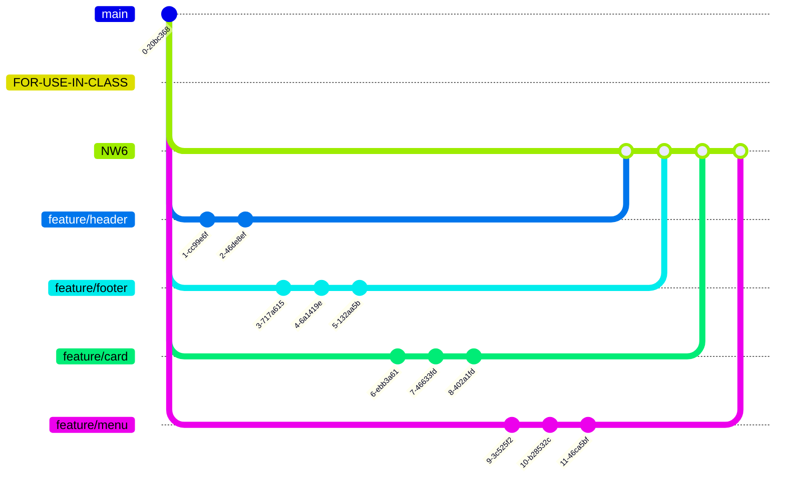

# Components are Functions

Today we're going to think some more about components. We're going to build a page using a design system and we're going to collaborate on a sub branch, feature branch workflow. We're going to identify the difference between HTML and the DOM using Devtools. And we're going to create new DOM nodes using JavaScript functions. Oh my goodness, it's so many things! That's why it's best to do this workshop after you've done:

- [x] [HTML-CSS](https://curriculum.codeyourfuture.io/html-css/)
- [x] [JS1](https://curriculum.codeyourfuture.io/js1/)
- [x] [JS2](https://curriculum.codeyourfuture.io/js2/)

And in particular, these workshops:

- [x] [Git](https://curriculum.codeyourfuture.io/induction/sprints/1/day-plan/#git-workshop)
- [x] [Devtools](https://curriculum.codeyourfuture.io/html-css/sprints/1/day-plan/#devtools-workshop)
- [x] [Components 101](https://curriculum.codeyourfuture.io/html-css/sprints/4/day-plan/#components-workshop)

If you missed these workshops in your cohort, it's a good idea to try to do them in the week (online) first. Record your session for people that can't attend. Everyone should try to do the workshops first, either in groups or solo if necessary.

The overall mission is to compose "components" / groupings of HTML elements to build a page in [together.html](https://cyf-workshops.netlify.app/components-2/together.html).

But this time, we're going to use JavaScript functions to build our components.

## Learning Objectives

```objectives
- [ ] 🤩 Work on a complex sub-branch workflow
- [ ] 🚢 Import a function from a module
- [ ] 🪄 Create a component on a web page
- [ ] 📖 Write a function to build a component from a documented pattern
- [ ] 👪🏿 Collaborate to build a page
```

<!---->

### Set up your working branch

Everyone should do this so everyone is set up correctly.

1. You will be working on a special branch called [FOR-USE-IN-CLASS](https://github.com/CodeYourFuture/CYF-Workshops/tree/FOR-USE-IN-CLASS).
1. First, **clone** [the workshops repository](https://github.com/CodeYourFuture/CYF-Workshops/)
1. Checkout `git checkout FOR-USE-IN-CLASS`
1. Your cohort has a named _sub branch_. Everyone, check that out next with `git checkout COHORT` (eg `NW6`). This is your working branch:



Check you are in the right place with GitLens!

<!---->

<!---->

Your COHORT branch is your cohort name. It might be NW6, WM5, GL7...You're working in your COHORT branch and NOT in main.

<!---->

Next, divide the class into four teams. Use the [team generator](teams.html) to help you do this.

Set a whole class [timer for 10 minutes](https://www.google.com/search?q=10+minute+time).

### Each team, choose a driver

1. Driver, ask everyone in your team to confirm you are in the right working branch.
1. Driver, from this branch, create and checkout a new branch for your team named like this: `feature/component`, where _cohort_ is your cohort name and _component_ is the component you're building, for example: `feature/header`

```bash
git switch --create feature/cohort-component
```

Now you're all set up to make changes to together.html.

<!---->

<!---->

## Find your docs

Set a whole class [timer for 10 minutes](https://www.google.com/search?q=10+minute+time).

Deployed from this repo is a [mini design system](https://cyf-workshops.netlify.app/components-2). This design system has several documented components, and some also have javascript files.

Your mission is to find the docs for each component with an associated script file, and read them. Discuss your findings. Look at the pages on the website with Devtools. Compare the Inspect view with the source code you can see in the files. How are they different? How are HTML and the DOM different?

<!---->

<!---->

### Together separately

Set a whole class [timer for 30 minutes](https://www.google.com/search?q=30+minute+time).
Now **build** your component. Elect a new driver.

1. Find [together.html](together.html) in the /components-2 directory. Your mission is to complete this page.
1. In the correct portion of the page, make your changes to build _your feature_ on together.html.
1. Driver, commit your changes to your feature branch.
1. Open a pull request from your branch to the COHORT branch, with your changes. Ask for help!
1. Remember, docs will help you too.
1. Do the simplest thing that could possibly work to begin with. You can always update your PR with more changes.

```mermaid
gitGraph
    commit id: "start"
    branch feature/component
    commit id: "import component function"
    commit id: "import data"
    commit id: "lighthouse revisions"
    checkout COHORT
    merge feature/component
```

<!---->

### Review and merge

Now we're going to review each other's work and merge to our cohort branch.

<!---->

Your COHORT branch is your cohort name. You're working in your COHORT branch and NOT in main. Open your pull request to your COHORT branch.

Don't open PRs to main. If you do open a PR to main and it is merged then it would break the exercise for other trainees.

<!---->

Set a whole class [timer for 30 minutes](https://www.google.com/search?q=30+minute+time).

<!---->

1. Go to the [pull requests](https://github.com/CodeYourFuture/CYF-Workshops/pulls) for this repo.
1. Either individually or as a group, review each other's PRs.
1. Once you're all happy with the PR, merge it.
1. Did it work? Why/why not? Discuss.

<!---->

## Acceptance Criteria

- We have worked in teams to build a page using Javascript components and modules
- We have used an advanced sub-branch feature branch workflow to collaborate
- We have reviewed each team's PR
