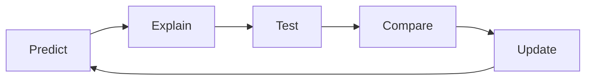

# Debugging is Asking Questions

## Prep

- [ ] Re-read this article about [Mental Models](https://jamesclear.com/mental-models)
- [ ] Watch this video about [VSCode Debugger](https://code.visualstudio.com/docs/introvideos/debugging) and follow along with the mini-workshop
- [ ] Open this [CYF Workshops repo](https://github.com/CodeYourFuture/CYF-Workshops/) in VSCode and go to the `debugging/bank` folder to find the problem bank.

Whew, that's loads! But we did set it all as coursework, so you have done it already, right? 😉

Today we're going to use our formal language of developer questions. We began with this basic format:

1. What I _did_
1. What I _expected_
1. What actually _happened_

This format helps to find the discrepancies between expectations and reality. (This is the gap in our understanding.)

It really helps us with debugging. Today we will use a debugger and our scientific method to find and fix bugs. Recall your scientific method:

<details>
<summary>Recap asking questions</summary>

### Predict & Explain

1. Make a _prediction_ by _explaining_ what the outcome will be

### Test

1. Run the code to see what actually happens

### Compare and Update

1. Compare the outcome with our prediction
1. Explain the gap between our prediction and what actually happened
1. Update our understanding

This process is cyclical.



</details>

## Setup

Get into pairs. Each pair consists of two roles:

1. **Computer:** Execute the code mentally, predicting the outcome.
1. **Debugger:** Use the VSCode debugger to step through the code.

You will swap roles after each exercise.

Set a whole class timer for [10 minutes](https://www.google.com/search?q=timer+for+10+minutes).


## Stepping

<!---->

### Identify the value of variables at each step in a loop.

```js
const sumArray = (numbers) => {
  let total = 0;
  for (let i = 0; i < numbers.length; i++) {
    total += numbers[i];
  }
  return total;
};
console.log(sumArray([1, 2, 3]));
```

#### Computer:

1. Write down predictions for `total` and `i` values before each loop iteration.
1. Compare predictions after each Debugger's step.

#### Debugger:

1. Open `sumArray.js` in VSCode.
1. Choose 'Run > Start Debugging' from the menu.
1. Set a breakpoint at `total += numbers[i];`.
1. Step into your function.
1. Step Over through iteration until your loop is complete.
1. Monitor `total` and `i` in the Variables section.

<!---->

## Debugging

Okay, swap roles. Set a whole class timer for [15 minutes](https://www.google.com/search?q=timer+for+15+minutes).

<!---->

```js
const findLargest = (numbers) => {
  let largest = numbers[0];
  for (let i = 1; i < numbers.length; i++) {
    if (numbers[i] > largest) {
      largest = numbers[i];
    }
  }
  return largest;
};
console.log(findLargest([3, 7, 2, 5, 6]));
```

#### Debugger:

1. Open `findLargest` in VSCode.
1. Predict the return value of `findLargest`. Write your prediction down.
1. Set a breakpoint at `if (numbers[i] > largest)`.
1. Debug and inspect `i`, `numbers[i]`, and `largest`.
1. Write down the return value of `findLargest([3, 7, 2, 5, 6])`.

#### Computer:

1. Predict the value of `largest` after each loop iteration.
1. 'Execute' the code and write down the actual value of `largest` after each loop iteration.
1. Write down the return value of `findLargest([3, 7, 2, 5, 6])`.
1. Now execute the code in VSCode. Did you get the same result?

Both (briefly) write up your mental model using this format:

1. What I _did_
1. What I _expected_. Make sure you include your prediction here
1. What actually _happened_

<!---->

Okay, swap roles. If you have time left and you're into this, there are many problems stored in `debugging/bank`. Set a whole class timer for [15 minutes](https://www.google.com/search?q=timer+for+30+minutes).

<!---->

Pick any problem from the bank and work through it together. Use the debugger and the scientific method to find and fix the bug.

Write up your findings in the developer question format. Swap roles and repeat until we run out of time.

<!---->

<details>
<summary>🧑🏾‍💻🙋 Developer questions contain</summary>

1. 🔗 Links 👍
1. Objectives - what are you actually trying to do? 👍
1. 🖼️ Screenshots of UI 👍
1. 📝 `Code blocks` 👍
1. 📷 ~~Screenshots of code~~ 🙅

## 📚 Further reading

- [How to ask](https://stackoverflow.com/help/how-to-ask)
- [The programming duck](https://rubberduckdebugging.com/)
- [Asking Questions](https://curriculum.codeyourfuture.io/guides/asking-questions/)

</details>
