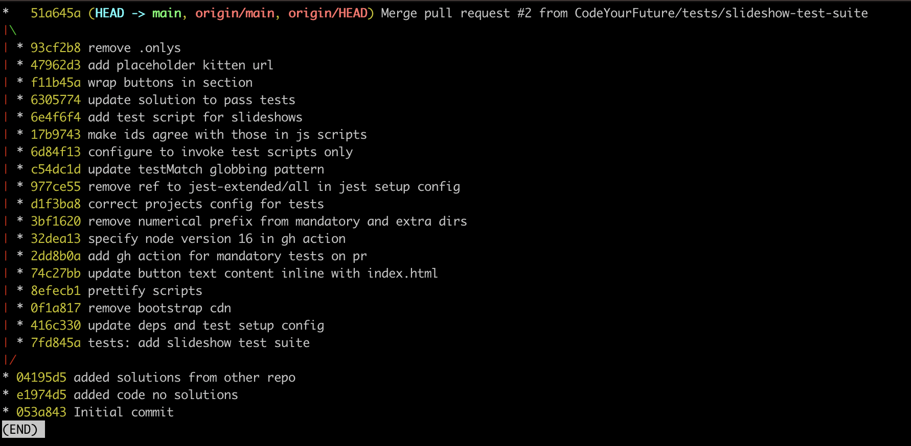
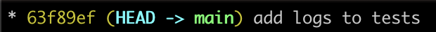

# Checking out 🌴

Let's remind ourselves what the commit history looks like:

Now what is `HEAD` ?

`HEAD` also points to a commit. `HEAD` points to `main` and `main` points to `51a645a`

🔑 `HEAD` tells us which files and folders we've got from the currently checked out commit.

This may seem confusing at first. So let's do some examples.

We're going to use the command `git log` and `git checkout` in order to understand these concepts more clearly.

## Steps 👣

Let's start by running the command `git log` again.

🏃  Run the command `git log` \
🖊️ Write down the commit hash of the **first commit in the timeline**
{WRITE THE HASH HERE}

🏃  Now run the command `git checkout {first-commit-hash}`\
🏃  Now run `git log --oneline`.

❓ What do you see now?
{OBSERVATION_HERE}

🏃 Now run `ls` and look at the files and folders in this commit.

❓ Q: How many files are there?\
❓ Q: How many `.md` files are there in the project?

It might be tempting to think that we've deleted all the other commits. However this isn't the case.

🏃  Run the command `git checkout main` again.\
🏃  Now run `git log` - 👀 what do you see?

Cool. Now `HEAD` is pointing back at the `main` branch.

Now write down the commit hash fo the git commit with message "update deps and test setup config"

🏃 Run `git checkout {commit-hash}`\
🏃 Run `ls` - what files and folders can you see in this snapshot? Are there any noticeable differences between the files and folders at this point in the timeline?

More questions:

❓ How many lines are there in the `quotes.test.js`?

🏃 Invoke the test suite in this file using the test script provided in the `package.json`

❓ What warning(s) do you see?

Can you fix the warnings? **harder

🖊️ Now checkout another commit hash and explore the files in there briefly.

[Next section](./4-staging.md)
