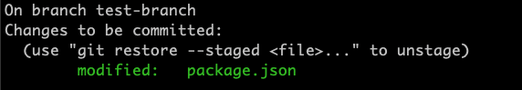

# Staging changes

## Updating the working tree

So, given our **working directory**, **timeline** - we might be asking:

> **How do we actually update the timeline?**
>
> Or in other words, **how do we add a commit to the end of our timeline?**

Let's make a change to the current working directory or working tree.

🏃 Open up this project in VSCode (if you've not done so already)\
🏃 Open up the `package.json` in the file editor.

The name property in the `package.json` is out of date.

🏃 Change the text from "CYF-Coursework-Template" to "javascript-core-2-coursework-week-4-solution"

## Inspecting the change

Now go to the Source Control tab in VSCode.

🏃 Click on `package.json`. You should be able to see `package.json (Working tree)` and this tells us the change we've just done in the **working directory**.

❗ Now we're at the point where we want to take a snapshot of the working directory with the updated file.

## Current mental model 🧠

Remember the mental model we've got...

- Working tree
- Commit timeline

And we're trying to take a snapshot of our working tree at the moment.

We're missing one final area in our mental model.
We need to introduce the **staging area**.

## Staging area 🔴 🟢

We need to tell Git which updated/new/deleted files we want to include in our next commit.
We do this by promoting these updates/new/deleted files to the **staging area**.

🔑 **Staging area** is the space to prepare (stage) the changes that will be reflected on the next commit.

Anything we put into the staging area we're saying:

> "Ok, which updated/new/deleted files would you like to put into your next snapshot?"
>
> "I'd like to save the updated file `package.json` in the next commit"
>
> "OK cool, anything you'd like to put in your next commit, please put it into the staging area"

In order to do this, we store the updated/new/deleted files in the staging area.

🏃 Let's start with a command `git status`.

🖊️ Write down what you think `git status` is doing.

ℹ️ You can run the command `git status --help` in order to work this out.\
👓 Look carefully at the output from this command.\
❓ What do you think it is telling you?

Goal:
So we need to move `package.json` into the staging area.
So we now run `git add package.json`

🏃 Now run `git status` again.

We now need to store this change in the working directory.
What do you see this time?

You should hopefully see something like this:

Now it's time to commit the change.
Research the command for doing a git commit.

## Doing it all again

On the `main` branch, if we run the tests, we see logs in the console.

