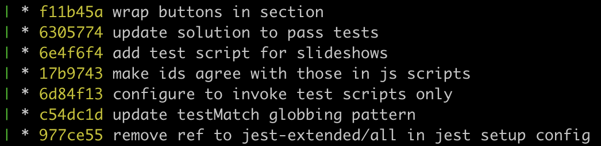

# Summary so far

OK so it's time to reflect on what we've learnt so far. And time to reflect on our current mental model.

In a git project, we have our **working directory**. Whenever we open a project ( using, for example, VSCode or a similar editor ) we can use terminal commands like `ls` and `cd` to list files, directories and navigate our file system.

We have git **commits** - these are snapshots of some of our files and folders in our project at a given moment in time.

And in Git we build up a timeline of commits that looks like something like this:

So in our mental model have 2 areas or states
- **working directory** 
- and a **timeline of commits**.\
And we also have the concept of branches...

## Branches

We have branches that point to commits. So the `main` branch points to this commit.

🔑 `HEAD` is another pointer. It points to the currently checked out commit - the commit whose files and folders we can currently see and edit in the file system.

When we run `git log` can list all the commits in the history of our project?\
When we run `git checkout {commit-hash}` - what are we doing?

Suppose we run the command `git checkout {commit-hash}`

Which commit will HEAD point to?\
Which commit will `main` point to?\
How did you reach this answer?

If you are lost in a git project. Then you should always go back to the mental model you have now.

🔑 Running a combination of `ls` and `cd` will always tell you what you've got in your **working directory** or **working tree**.

🔑 Running the command `git log` will tell you the current history and show you were `HEAD` points to. Most of time, `HEAD` will point to the current branch you're on.

🔑 You can return to an earlier point in your commit history by running the command `git checkout {commit-hash}`. This command will update `HEAD` to point to the specified commit and Git will load the files and folders from this snapshot into your file system.
