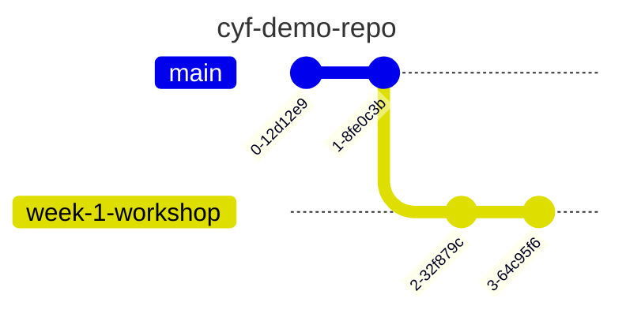
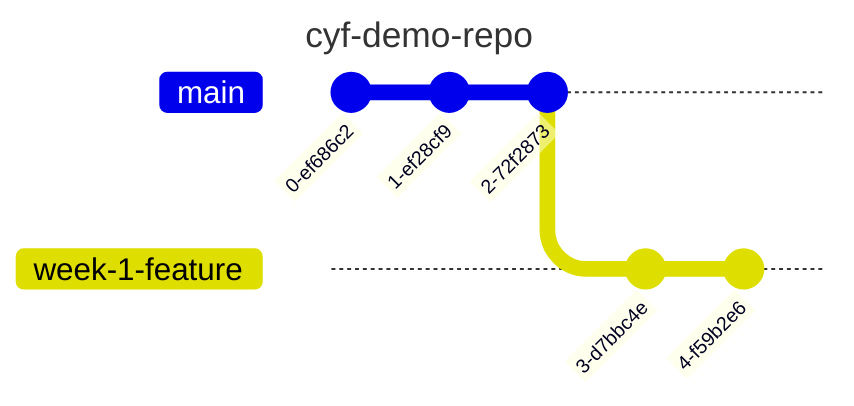

# Git Day 1

Git is a tool for software development that you will likely come to rely on in your software development journey. It might seem complex at first but with continuous practice, you will begin to disentangle the complexity.

## 💡 Objective

This workshop will deepen your understanding of Git. By the end of this workshop, participants will: 
- [ ] Navigate a GitHub repository using the VSCode interface
- [ ] Fork and clone a repository, create branches, and commit changes using the VSCode interface
- [ ] Articulate the difference between a fork and clone
- [ ] Explain their <strong>mental model</strong> of the working tree and the staging area

## Setup 

- Break out into groups of 5/6 ( depending on volunteer and trainee numbers )
- Use these instructions as a guide to check your understanding, resolve misconceptions and develop your understanding

This workshop starts with a recap based on this week's prep material...

## Exploring GitHub repositories

### Recap activity 🕹️

- Trainees do this section in pairs
- ⏲️ 10 mins

Let's recap some of the things from earlier in the week.

Visit the following repository on GitHub: https://github.com/CodeYourFuture/cyf-demo-repo

Answer the following questions:


a) How many commits are there in the cyf-demo-repo project?

b) Who committed on Oct 31, 2020?  

c) What changes did illictonion make in the commit titled "Revert changes accidentally pushed in the past"?  

d) How many files were added in the first commit? What were the names of the files?  

e) What is the hash for the first commit in the history?

f) What is Claire Bickley's favourite food?


### 🧵🗣️ group discussion 

- Group discussion
- ⏲️ 10 mins
- A volunteer will need to facilitate this section

A volunteer can facilitate this group discussion by going through the questions above and asking pairs for their feedback. If pairs are unsure / not quite accurate then spend a small amount of time addressing misconceptions.
Remember to ask around for feedback.


## Creating a fork 🍴

### 🕹️ Recap activity 

- Trainees do this section in pairs
- ⏲️ 5 mins

Use the guidelines from the prep section of this week to create a fork.

1. On one person's computer, fork this repo: https://github.com/CodeYourFuture/cyf-demo-repo
2. 📝 Double-check the URL of your forked repo. How can you tell the fork was successfully created?

### Group discussion/demo 🧵 🗣️

- Groups discussion
- ⏲️ 5 mins
- A volunteer will need to facilitate this section

A volunteer will need to navigate and let the group guide them in creating a fork.

## 🌀 Cloning a repository 

### 🕹️ Recap activity 

- Trainees do this section in pairs
- ⏲️ 5 mins

#### 📋 Check your understanding

Before continuing, try answering the following:

❓ what is the difference between a **fork** and a **clone**.

Remember to check your answer before continuing.


1. Clone your fork of `cyf-demo-repo` to your local machine.
2. Open this local repository using VSCode.
3. Use `pwd` in your terminal to check you're in the right place.


### Group discussion/demo 🧵 🗣️

- Group discussion/demo
- ⏲️ 5 mins
- A volunteer will need to facilitate this section

A volunteer will need to navigate and let the group guide them in following through the steps in the previous recap activity.


## 🌳 Creating a branch

### 🕹️ Recap activity 

- Trainees do this section in pairs
- ⏲️ 10 mins

Next, create a local branch called `week-1-workshop`

### Group discussion/demo 🧵 🗣️


- Group discussion/demo
- ⏲️ 10 mins
- A volunteer will need to facilitate this section


## Take a break for 10 mins... 🍫


## Part 2 - New skills 🧰 - Committing and pushing 📸


### Learning objectives

```objectives
- [ ] Save local changes to a repository in VSCode
- [ ] Stage local changes
- [ ] Commit changes to a local branch
- [ ] Define "pushing"
- [ ] Push local changes onto a remote repository


### 🕹️ Activity - Figure it out 🔍 


> 🎯 Goal: Make some **local** changes and create a **local commit** on our branch.

- Do this section in pairs
- ⏲️ 15 mins 

Follow these instructions carefully.

Our Git timeline starts with some commits like this:


We're going to figure out how to 

- make local changes and commit them to our branch "week-1-workshop",

so our history looks something like this:


where the most recent commits contain our changes.

To create a commit, we can use the following steps (explained more below):

1. Make a change to a file
2. View the local changes
2. Stage the changes
3. Creating the commit


### 🗄️ 1. Make a change to a file

1. Open up your local repo `cyf-demo-repo` in VSCode.
2. Go to the Explorer section of VSCode ( look for a 🔍 icon ).
3. Find `file.txt` and edit the file with the answer to the questions.
4. Remember to save the changes to `file.txt`.

Tip: 
- You can use <kbd>Cmd</kbd> + <kbd>S</kbd> on a Mac to save changes to a file in VSCode.
- You can use <kbd>Ctrl</kbd> + <kbd>S</kbd> on a Linux OS to save changes to a file in VSCode.


### 🔬 2. View the local changes


We want to view the changes we've just made to our working directory.

1. Locate the **Source Control** tab in VSCode.

2. Go to the Changes section and click on the file you changed - this should now show the changes for the file.
3. Try editing the file again in the Explorer tab and check to see the update is visible in the Source Control panel


### 🟢 3. Stage the changes

We need to tell Git which changes we want to be part of our next commit.


Each commit is a checkpoint we've decided to save. When making a commit, we can decide to _not_ include all of our changes in the checkpoint, but just include some of them.

We choose which changes we want to include in a commit by **staging our changes**.


In the Source Control tab again...

1. Go to the file `file.txt` and click on the **+**.

👓 Notice what happens when you carry out step 1.

2. View the **Staged Changes** area in your **Source Control** panel.

### 📸 4. Create the commit

Once we've staged our changes, then we can **commit** these changes.

Before we do, we should make sure we're on the correct branch. Check that you're on the `week-1-workshop` branch.


Your VSCode window should look like this:


and not like this:


If you're sure you're on the right branch:

1. Enter a commit message describing briefly what you did in your commit.
2. Click Commit to create the Git commit.

📝  Now figure out how many commits you have on your local machine.

🧠 Explain what you think would have happened if you didn't stage anything in your working directory when you made your commit.


### When you're finished...

❗ Once you've completed this **commit**, swap roles in your pair.
Choose another file and then go through the steps in the [Creating a commit section](#-4-creating-a-commit)


### Group discussion/demo 🧵 🗣️

- Group discussion/demo
- ⏲️ 10 mins
- A volunteer will need to facilitate this section

A volunteer will now need to navigate with directions from the group. Go through the git commit steps together.
Also use this time for clarifying questions.

## 🫸 Pushing

> 🎯 Goal: Push a branch to a remote repository

### 🕹️ Activity - Figure it out 🔍 

- Trainees work in pairs
- ⏲️ 5 mins

After committing your work on your machine, you'll have a local branch that looks like this




📋 Double-check you've been committing to your branch `week-1-workshop` branch and not your `main` branch. 


However, our remote fork only has a main branch:


In other words, we have _not_ added our local branch onto the remote fork on GitHub.

To do this, we must **push** our branch onto GitHub.


**push** means adding local work to a remote GitHub repository.


🔍 Figure out how to **push** your local branch to the GitHub repository using the Source Control interface in VSCode.
🔍 Figure out how to check the `week-1-workshop` branch is on the remote fork.


### Group discussion

- Group discussion/demo
- ⏲️ 5 mins
- A volunteer will need to facilitate this section

A volunteer will need to navigate and let the group guide them in following through the steps in the previous recap activity.


## 🧵 Tying things up

Now is some time to wrap up and discuss some of the key concepts from this week.

###  🗣️ Discussion in pairs

- Trainees discuss in pairs
- ⏲️ 10 mins

In your pair, discuss the following questions/tasks:

1. What is a commit? Explain why we need to make commits when we're developing a project.
1. Explain why we store repositories on GitHub.
1. Describe the purpose of VSCode.
1. Explain the difference between Git and GitHub.
1. Explain why developers use branches.
1. Explain the difference between a fork and a clone.
1. what does the branch name `origin/main` mean instead of just `main`.
1. Check out the following git repository diagram below:

How many commits are in common between `week-1-feature` and `main`?



###  🗣️ Group discussion

- Discuss the questions together as a group. Go round and get feedback from each person in the group.


