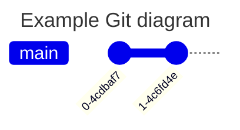
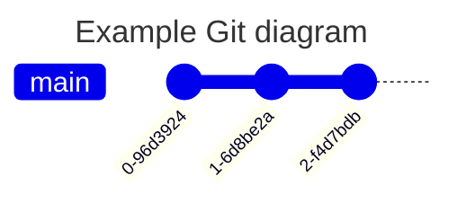

# 📸 Creating a commit

In this workshop, you'll learn the following: 

- how to make local changes in VSCode
- how to stage changes
- how to commit changes
- how to 

In this workshop, you'll learn how to create a commit on your local machine.
At the same time, you'll start to develop an understanding for how Git works.

## Recap activity

### Pairs
### ⏲️ ( 15 mins )

Let's recap some of the things from earlier in the week.

Visit the following repository on Github: https://github.com/CodeYourFuture/cyf-demo-repo

You'll need to answer the following questions:

a) How many commits are there in this project? 
b) Who committed on Oct 31, 2020?
c) What changes did Illictonion do in the commit titled "Revert changes accidentally pushed in the past"?
d) How many files were added in the first commit? What were the names of the files?
e) What is the hash for the first commit in the history?

In your pair, discuss briefly:

- what is a commit ?
- why do we store repositories on Github?
- what is VSCode used for ?

## 🍴 Creating a fork

### Pairs
### ⏲️ ( 15 mins )

- Create a **fork** of the Github repository
- Create a 

## Getting a local repository

Learn the steps to clone a public repository from GitHub to your local computer using Visual Studio Code.

In this section, you'll need to clone a remote repository from Github on to your local machine.

### Pairs
### ⏲️ ( 15 mins )

- Get a local copy of a repository on your local machine. Open the files and folders of your copy on your local machine.

## Creating a commit

Pairs
⏲️ ( 20 mins )

We have the following goal in this section:

> 🎯 Goal: Make some **local** changes and create a **local commit**.

Our Git timeline starts off in this way:

We want to figure out to make local changes and then commit them so our timeline ends up looking like this:

where the most recent commit contains our recent changes.

To create a commit, we're going to step through the following process:

1. Make a change to a file
2. Stage the changes
3. Create the commit

### 🗄️ Changing a file

Go to your files and folders in the repository. Now answer the question in line 10 on the Github repository. Save the file.

Tip: You can use CMD + S to save changes to a file in VSCode.

### Viewing the changes

We want to view the changes we've made to our working directory so we can start making a commit.

1. Go to the **Source Control** tab in VSCode.

2. Go to the Changes section and look at the changes for the file.
3. Try editing the file again in the Explorer tab and check to see the update is visible in the Source Control panel

### Staging changes

To create a commit, we need to tell Git the changes we want to include in the next commit.
So if we change a file, we need to **stage** this changed file.

Let's put the changed file into the **staging area**.

1. Go to the file `README.md` and click on the **+**.

Notice what happens when you carry out step 1.

2. View the Staged Changes area in your Source Control panel.

### 📸 Creating the commit

Once we've staged changes, then we can **commit** these changes.

📝 Check the number of commits you have locally. They should still be the same as before.

1. Enter a commit message describing briefly what you did in your commit.
2. Click Commit to create the Git commit.

📝  Now re-check the number of commits you have locally.

> ❗ Once you've completed this **commit**, you can swap roles in your pair.