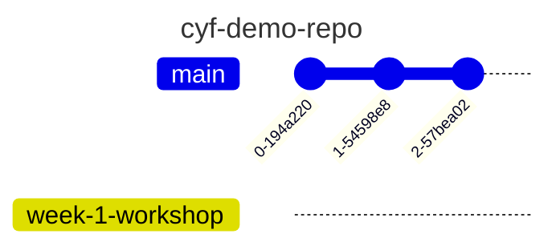
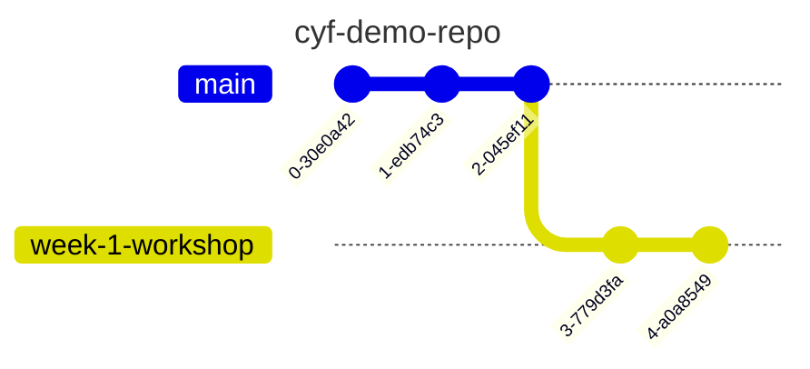

 # Part 1


This workshop starts with a recap based on this week's prep material...

## Exploring GitHub repositories

### Recap activity 🕹️

- Trainees do this section in pairs
- ⏲️ 10 mins

Let's recap some of the things from earlier in the week.

Visit the following repository on GitHub: https://github.com/CodeYourFuture/cyf-demo-repo

Answer the following questions:


a) How many commits are there in this project?
b) Who committed on Oct 31, 2020?  
c) What changes did illictonion make in the commit titled "Revert changes accidentally pushed in the past"?  
d) How many files were added in the first commit? What were the names of the files?  
e) What is the hash for the first commit in the history?  

In your pair, discuss briefly:

- what is a commit ?
- why do we store repositories on GitHub ?
- what is VSCode used for ?

### 🧵🗣️ Whole group discussion 

- Whole class discussion
- ⏲️ 10 mins
- A volunteer will need to facilitate this section

A volunteer can facilitate a whole group discussion by going through the questions above and asking pairs for their feedback. If pairs are unsure / not quite accurate then spend a small amount of time addressing misconceptions. Remember to ask around for feedback 


## Creating a fork 🍴

### 🕹️ Recap activity 

- Trainees do this section in pairs
- ⏲️ 5 mins

Use the guidelines from the prep section of this week to create a fork.

1. On one person's computer, fork this repo: https://github.com/CodeYourFuture/cyf-demo-repo
2. 📝 Double-check the URL of your forked repo. How can you tell the fork was successfully created?

### Whole group discussion/demo 🧵 🗣️

- Whole class discussion
- ⏲️ 5 mins
- A volunteer will need to facilitate this section

A volunteer will need to navigate and let the group guide them in creating a fork as per the steps in the previous section.

## 🌀 Cloning a repository 

### 🕹️ Recap activity 

- Trainees do this section in pairs
- ⏲️ 5 mins

#### 📋 Check your understanding

Before continuing, try answering the following:

❓ what is the difference between a **fork** and a **clone**.

Remember to check your answer before continuing.


1. Clone your fork of `cyf-demo-repo` to your local machine.
2. Open this local repository using VSCode.
3. Use `pwd` in your terminal to check you're in the right place.


### Whole group discussion/demo 🧵 🗣️

- Whole class discussion/demo
- ⏲️ 5 mins
- A volunteer will need to facilitate this section

A volunteer will need to navigate and let the group guide them in following through the steps in the previous recap activity.


## 🌳 Creating a branch

### 🕹️ Recap activity 

- Trainees do this section in pairs
- ⏲️ 10 mins

Next, create a branch so that your local git repository looks like this:

TODO: I don't think this diagram is very clear, it's not obvious that week-1-workshop has the same commits as main in it? It kind of looks like week-1-workshop doesn't have any commits on it at all?


### Whole group discussion/demo 🧵 🗣️


- Whole class discussion/demo
- ⏲️ 10 mins
- A volunteer will need to facilitate this section


## Take a break for 10 mins... 🍫


## Part 2 - New skills 🧰 - Committing and pushing 📸

TODO: These aren't currently folded into a collapsable learning objectives block - they probably should be?
```objectives

- [ ] save local changes to a repository in VSCode
- [ ] stage local changes
- [ ] commit changes to a local branch
- [ ] define "pushing"
- [ ] push local changes on to remote repository

```


### 🕹️ Activity - Figure it out 🔍 


> 🎯 Goal: Make some **local** changes and create a **local commit** on our branch.

- Do this section in pairs
- ⏲️ 25 mins 

Follow these instructions carefully.


Our Git timeline starts off with some commits like this:



We're going to figure out how to 

- make local changes and commit them to our branch "week-1-workshop",

so our history looks something like this:



where the most recent commits contain our changes.

To create a commit, we can use the following steps (explained more below):

1. Make a change to a file
2. View the local changes
2. Stage the changes
3. Creating the commit


### 🗄️ 1. Make a change to a file

1. Open up your local repo `cyf-demo-repo` in VSCode.
2. Go to the Explorer section of VSCode ( look for a 🔍 icon ).
3. Find `file.txt` and edit the file with the answer to the questions.
4. Remember to save the changes to `file.txt`.

Tip: 
- You can use <kbd>Cmd</kbd> + <kbd>S</kbd> on a Mac to save changes to a file in VSCode.
- You can use <kbd>Ctrl</kbd> + <kbd>S</kbd> on a Linux OS to save changes to a file in VSCode.


### 🔬 2. View the local changes


We want to view the changes we've just made to our working directory.

1. Locate the **Source Control** tab in VSCode.


2. Go to the Changes section and click on the file you changed - this should now show the changes for the file.
3. Try editing the file again in the Explorer tab and check to see the update is visible in the Source Control panel


### 🟢 3. Stage the changes

We need to tell Git which changes we want to be part of our next commit.

Each commit is a checkpoint we've decided to save. When making a commit, we can decide to _not_ include all of our changes in the checkpoint, but just include some of them.

We choose which changes we do want to include in the commit by **staging our changes**.

In the Source Control tab again...

1. Go to the file `README.md` and click on the **+**.

👓 Notice what happens when you carry out step 1.

(In this course, you will probably want to just stage all of your changes most of the time).

2. View the **Staged Changes** area in your **Source Control** panel.

### 📸 4. Create the commit

Once we've staged our changes, then we can **commit** these changes.

Before we do, we should make sure we're on the correct branch. Check in the bottom-right of your VS Code window that it looks like this:


Not like this:


If you're sure you're on the right branch:

1. Enter a commit message describing briefly what you did in your commit.
2. Click Commit to create the Git commit.

📝  Now figure out how many commits you have on your local machine.

🧠 Explain what you think would have happened if you didn't stage anything in your working directory when you made your commit.


### When you're finished...

❗ Once you've completed this **commit**, swap roles in your pair.
Choose another file and then go through the steps in the [Creating a commit section](#-4-creating-a-commit)


### Whole group discussion/demo 🧵 🗣️

- Whole class discussion/demo
- ⏲️ 10 mins
- A volunteer will need to facilitate this section

A volunteer will need to navigate through the steps in the previous section with directions from the group.
Also time for clarification questions too.


## 🫸 Pushing

> 🎯 Goal: Push a branch to a remote repository

### 🕹️ Activity - Figure it out 🔍 

- Trainees work in pairs
- ⏲️ 15 mins

After committing your work on your machine, you'll have a local branch that looks like this


📋 Double-check you've been committing to your branch `week-1-workshop` branch and not your `main` branch. 


However, our remote fork only has a main branch:


In other words, we have _not_ added our local branch onto the remote fork on GitHub.

To do this, we must **push** our branch onto GitHub.


**push** means adding local work to a remote GitHub repository.


🔍 Figure out how to **push** your local branch to the GitHub repository using the Source Control interface in VSCode.


### Group discussion

- Whole class discussion/demo
- ⏲️ 10 mins
- A volunteer will need to facilitate this section

A volunteer will need to navigate and let the group guide them in following through the steps in the previous recap activity.

TODO: I would have expected three more sections here:
1. Looking at the remote branch on the GitHub UI and seeing it's there
2. Creating a pull request
3. A bit of discussion about code review - how to leave a comment, how to view comments, how to respond to comments.
The first seems important, the other two can probably wait, but should probably be covered somewhere.


