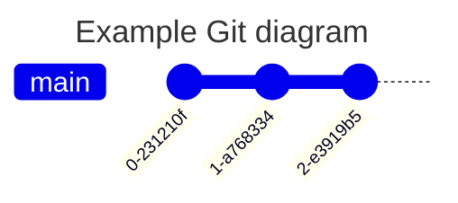

# 📸 Creating a commit

In this workshop, you'll learn the following: 

- how to make local changes in VSCode
- how to stage changes
- how to commit changes

In this workshop, you'll learn how to create a commit on your local machine.
At the same time, you'll start to develop an understanding for how Git works.

## Recap activity

### Pairs

### ⏲️ ( 15 mins )

Let's recap some of the things from earlier in the week.

Visit the following repository on Github: https://github.com/CodeYourFuture/cyf-demo-repo

You'll need to answer the following questions:

a) How many commits are there in this project?  
b) Who committed on Oct 31, 2020?  
c) What changes did Illictonion do in the commit titled "Revert changes accidentally pushed in the past"?  
d) How many files were added in the first commit? What were the names of the files?  
e) What is the hash for the first commit in the history?  

In your pair, discuss briefly:

- what is a commit ?
- why do we store repositories on Github ?
- what is VSCode used for ?

## 🍴 Creating a fork

### Do this section in pairs
### ⏲️ ( 10 mins )

- Create a **fork** of the Github repository
- Create a 

## Getting a local repository

Learn the steps to clone a public repository from GitHub to your local computer using Visual Studio Code.

In this section, you'll need to clone a remote repository from Github on to your local machine.

### Do this section in pairs
### ⏲️ ( 10 mins )

Get a local copy of a repository on your local machine. Open the files and folders of your copy on your local machine.

## Creating a commit

> 🎯 Goal: Make some **local** changes and create a **local commit**.

### Do this section in pairs 
### ⏲️ ( 25 mins )

We have the following goal in this section:

Our Git timeline starts off in this way:

We want to figure out to make local changes and then commit them so our timeline ends up looking like this:

where the most recent commit contains our recent changes.

To create a commit, we're going to step through the following process:

1. Make a change to a file
2. View the local changes
2. Stage the changes
3. Create the commit

### 🗄️ 1. Make a change to a file

1. Open up your local github repo `cyf-demo-repo` to 
2. Go to the Explorer section of VSCode
3. Locate `file.txt` and edit the file with the answer to the questions.
4. Remember 

Tip: You can use CMD + S to save changes to a file in VSCode.

### 🔬 2. View the local changes

We want to view the changes we've just made to our working directory.

1. Go to the **Source Control** tab in VSCode.

2. Go to the Changes section and look at the changes for the file.
3. Try editing the file again in the Explorer tab and check to see the update is visible in the Source Control panel

### 🟢 Staging changes

We need to tell Git which changes we want to be part of our next commit. 

We do this by **staging our changes**.

1. Go to the file `README.md` and click on the **+**.

👓 Notice what happens when you carry out step 1.

Explain what you think will happen if you don't stage anything in your working directory.

2. View the **Staged Changes** area in your **Source Control** panel.

### 📸 Creating the commit

Once we've staged changes, then we can **commit** these changes.

📝 Check the number of commits you have locally. They should still be the same as before.

1. Enter a commit message describing briefly what you did in your commit.
2. Click Commit to create the Git commit.

📝  Now re-check the number of commits you have locally.

### When you're finished...

> ❗ Once you've completed this **commit**, you can swap roles in your pair.
> Choose another file and then go through the steps in [Creating a commit section](#creating-a-commit)