# 🧑‍🏫 Instructional design at CYF

```objectives
- [ ] Explain the CYF approach to writing coursework
- [ ] Identify instructional techniques in existing materials
- [ ] Revise a coursework task to fit the CYF approach
```

What is a [well designed piece of coursework](https://files.eric.ed.gov/fulltext/ED498555.pdf)? How do we identify if study materials are well or poorly designed? How do we revise coursework tasks to make them more **effective**?

There are six key instructional techniques with _reasonably_ sound evidence behind them.


We're going to identify these foundational strategies in existing materials. Then we're going to identify some ways to bring them into our own material.

1. "[Dual coding](https://www.structural-learning.com/post/dual-coding-a-teachers-guide)" or pairing graphics with words
2. [Concrete examples](https://www.learningscientists.org/concrete-examples)
3. [Elaboration](https://www.educ.cam.ac.uk/research/programmes/classroomdialogue/) or [probing questions](https://www.bell-foundation.org.uk/resources/great-ideas/questioning-strategies/)
4. Interleaving [solved problems](https://en.wikipedia.org/wiki/Worked-example_effect)
5. [Spaced repetition](https://en.wikipedia.org/wiki/Spaced_repetition)
6. Retrieval through quizzing

In other words:

> **Teaching isn't _telling_, it's guiding. **

## 🧑‍🎓 Activity

1. Read [Annotating texts - OCR - GCSE English Language Revision - OCR - BBC Bitesize](https://www.bbc.co.uk/bitesize/guides/zcbw7hv/revision/1)
2. Annotate this text. Circle these specific strategies
   - Concrete example of where this useful
   - Worked example / solved example
   - Dual coding
   - Retrieval through quizzing

## 🧑‍🎓 Activity

It's common for people to begin creating course materials as a sequenced "todo" list. Do this, then that. But this doesn't guide the learner effectively towards understanding. We must move from "do this" to "Do what? Why, and _how_?"

Here is a random piece of coursework: [https://github.com/CodeYourFuture/Course-Fundamentals/issues/23](https://github.com/CodeYourFuture/Course-Fundamentals/issues/23)

<details>
<summary> Copied here for posterity </summary>

### Coursework content

Write 1 paragraph of your personal story/statement

### Estimated time in hours

1

### What is the purpose of this assignment?

1. Write a 1 paragraph statement - between 50 and 100 words. Think about skills you have that can be used in your future job in tech, and mention them in this text.
2. Check grammar using [Grammarly](https://www.grammarly.com/). You should not have more than 3 mistakes.
3. Add your statement to the "Personal Statement" thread on the Cohort Slack channel. If the thread hasn’t been created yet, please do it.

### How to submit

Add the link to your post on Slack on this coursework
Add a screenshot of your post on this coursework

### Anything else?

[This video](https://slack.com/intl/en-gb/help/articles/202528808-Search-in-Slack) explains how to search in Slack

</details>

This is a formal writing task. We assign lots of these as they are essential! These **putting ideas in** tasks have the same repeated pattern:

1. What is the FORMAT?
1. What are the GOALS?

And leads to a subsequent metacognitive activity: **getting ideas out**

> How do we **test** that our writing **achieves** our goals?

Let's **revise** this. Write your revised assignment in the worksheet below.

## 💡Key Tips

1. 🎯Start with the motivation: why is this useful to me?
2. ✅Give an example solution: what does success look like?
3. 🍱Create an analysing, categorising, summarising, illustrating, or explaining activity
4. 📌Set the initial task (3 and 4 can be in either order)
5. 🧪Make it testable. How will the _learner_ assess their understanding?

```mermaid
flowchart LR
A[📍 Learner] <-->|🕵🏾 connect| B[Teacher]
B -->|👣 extend| C([📍 Concept])
```



---

## ✏️Worksheet:

## Write a Personal Statement Task Revision

<div contenteditable=true>
Work on your revision on a document or a piece of paper. 
</div>

---

## ✅ Worksheet worked example

## Personal statement

### 🧩 What is the FORMAT?

- 1 paragraph
- No personal pronouns
- 50 to 150 words
- At the top of a CV straight after your name and contact information

Career changer with ten years solid experience in original field, but latterly caught the coding bug. Spent the last two years working on software development obsessively. Build real products as a volunteer in small teams every week. Building with TypeScript, React, Node, Deno, Rust, GraphQL - just name it. Automating the deployment of containerised applications to AWS just for fun. Linked portfolio is stuffed with original, inventive, useful passion projects. Excited to learn more. More more more!

### 🎯 What are the GOALS?

A great personal statement grabs you from the first line. The point is to make you, particularly you, stand out from the hundreds of people your reader is sifting through. This is your best chance to clearly connect your specific personal achievements with some of the skills listed on the job description in a short, clear, paragraph. Your reader comes away thinking "I want to interview _this_ one!" An effective personal statement is confident, distinctive, and shares just enough to make you want to **read the rest of the CV**.

### 🧪 And how do we TEST?

#### Make a game

_My suggestions: We are building confidence and expression here. We don't need to grade these attempts, we need to stage opportunities for the learner to evaluate effective and ineffective texts, including but not limited to their own._

##### 🪡 Energiser: Haystack

Take the names off everyone's personal statement and mix them up (and add in some AI generated ones). Now try to match the statement to the person. The person who is the most easily identifiable wins.

##### ⏲️ Energiser: Play recruiter

Give everyone a job description and a big stack of CVs. Set a timer for 5 minutes. You must shortlist to three candidates. If your candidates are the "best match", you win!

##### 💡 Energiser: Buzz off!

(Sorting words is a familiar strategy for identifying categories. Categorising is a key learning activity. It helps us organise and structure our understanding.)

1. First exercise: sort the words into two groups: expressive and obscuring / straightforward and jargon etc

> Dynamic, use, passionate, software engineer, show, care, build, team player, utilize, make, showcase, work together, leverage, detail-oriented, dedication, developer

2. Second exercise, now you have identified them, highlight the buzzwords

"As a <mark>dynamic</mark> and <mark>passionate</mark> junior developer, I am an <mark>enthusiastic team player</mark> dedicated to <mark>utilizing</mark> my <mark>detail-oriented</mark> approach to <mark>showcase</mark> my skills. With an unwavering <mark>dedication</mark> to <mark>leveraging cutting-edge technologies</mark>, I strive to bring <mark>innovative solutions</mark> to the table. My <mark>commitment to excellence</mark> allows me to <mark>leverage my expertise</mark>, <mark>showcasing a unique ability</mark> to tackle complex challenges with meticulous <mark>attention to detail</mark>. I am eager to <mark>leverage my passion</mark> for programming and dedication to <mark>continuous learning</mark>, making me a <mark>valuable asset</mark> to any <mark>dynamic team</mark> environment."

3. Third exercise: collectively revise this statement to reduce the number of buzzwords.
