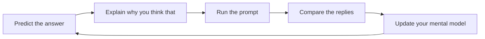

# LLM Writing 1

## Overview

A workshop to help you write meaningful texts with AI and stop dismaying us all with gibberish.

## Learning Objectives

```objectives
- [ ] Generate texts with multiple large language models (LLM)
- [ ] Compare the texts generated by different LLMs
- [ ] Identify the **problems** with the generated texts
- [ ] Use the strengths and weaknesses of different LLMs to write your own text
```

## Requirements

1. Open accounts with [Claude](https://claude.ai/), [ChatGPT](https://chatgpt.com/), and [Gemini](https://gemini.google.com/) (or similar)
1. Open each account in a separate tab

I have provided a series of queries for you to run in a sequenced dialogue. Just as in coding, you will use the predict explain loop to first make a prediction yourself and then compare against the computer output.



## Workshop

<!---->

### One, generate

Copy and paste the following prompt into each 🤖 LLM dialog:

> Write a 250 word essay reflecting on your strengths and development areas as a result of feedback and what is one action for each you will take.

<!-- -->
<!---->

### Two, compare

Now copy and paste each 🤖 LLM response into one google doc, so all three replies are in one doc. Read the replies. All three are easily identifiable as 🤖 LLM generated texts. Can you tell why this is? **✍🏽 Write down your ideas**.

Next, add the following prompt to the first line of your google doc:

> All three are easily identifiable as LLM generated texts. Can you tell why this is?

Now **paste the entire text** of the doc you just made into each LLM dialog and read the replies. How do your ideas compare to the LLM responses to the same question?

<!-- -->
<!---->

### Three, revise

How would you fix this? **✍🏽 Write down your ideas.**

Next, ask each 🤖 LLM in turn, by pasting the prompt:

> How would you fix this?

<!-- -->
<!---->

### Four, reflect

You are using 🤖 LLM to write your essays and reflections but your reviewers often say your writing is generic and pointless. How can you improve? **✍🏽 Write down your ideas.**

Finally, ask each 🤖 LLM in turn, by pasting the prompt:

> I use you to write my essays and reflections but my teacher says my writing is generic and pointless. How can I improve?

<!-- -->
<!---->

### Five, create

✍🏽 Write a 250 word essay reflecting on your strengths and development areas as a result of feedback and one action you will take for each area.

<!-- -->

## Acceptance Criteria

- I have generated multiple texts with different LLMs
- I have written down my own ideas first and then compared them to the LLM
- I have clearly identified the problems with the generated texts
- I can explain the difference between superficial fluency and meaningful information
