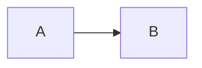

# Welcome to CYF Workshops

This is a shared repository of workshops developed by CYF volunteers. All these workshops are open source and free to use. Workshops are group activities generally run on CYF class days, or sometimes in midweek sessions.

Some of these workshops are shown on the [CYF curriculum site](https://curriculum.codeyourfuture.io) day plans. Others are used in other contexts. All are welcome!

## How to contribute

Report issues by opening a ticket on this repo. If you are talking about a specific workshop, please include the name of the workshop in the title of the ticket and @mention the author of the workshop in the body of the ticket. There's no guarantee the author is still around!

To contribute a workshop, open a pull request and label it [New Workshop]. There's a [template folder](./template) with some helpful notes.

Please only submit workshops you actually plan to use in a currently running cohort (or have run in a past CYF cohort).

## Deployments

1. This repo has a micro front end that will [render your workshops in the curriculum theme](https://workshops.codeyourfuture.io/). Look through workshops and decide which to use with your cohort.  [](https://app.netlify.com/sites/cyf-workshops/deploys)

2. This _entire_ repo is also deployed to Netlify under the name `cyf-workshop`, so any index.html you upload to your folder will create a webpage you can use in your workshop. 

For example:
https://github.com/CodeYourFuture/CYF-Workshops/tree/main/asking-questions deploys itself here: https://cyf-workshop.netlify.app/asking-questions/

Pull requests against this repo will automatically generate disposable branch previews and a bot will link these on the PR. This will work for trainees, if that is useful for your activity.

<details>
<summary>

## Magic
</summary>

These workshops are pulled through to various front ends and displayed using the [CYF Common Theme](https://common.codeyourfuture.io/). Write for GitHub first, but you can secretly jazz up your layouts for those contexts by using [Hugo shortcodes](https://common.codeyourfuture.io/common-theme/shortcodes/) wrapped in HTML comments. You can add any shortcode in comments and it will be parsed and rendered on our curriculum sites, but not here. 
#### Look in the source code
<!---->
This note will just be a block of text on GitHub, but a styled section on the curriculum
<!---->

We are working on uniting the views as much as we can. These features can be rendered in both places:
#### Notes
>[!TIP]
>GitHub style notes will be rendered as notes on Common
#### Objectives
```objectives
- Start with the active verb
- Make your objectives testable
```
Objectives wrapped in a [codeblock with the string objectives](https://common.codeyourfuture.io/common-theme/render-hooks/objectives/) will be piped into the [curriculum success pages](https://common.codeyourfuture.io/common-theme/pages/success/)
#### Diagrams

[Mermaid](https://mermaid.live/edit) works on [Common, exactly the same,](https://common.codeyourfuture.io/common-theme/render-hooks/mermaid/) and any diagrams you write in a readme or issue will render there too. There’re flowcharts, sequence diagrams, gantt charts, mindmaps, and more.

Find more [render hooks on Common](https://common.codeyourfuture.io/common-theme/render-hooks/).

</details>
