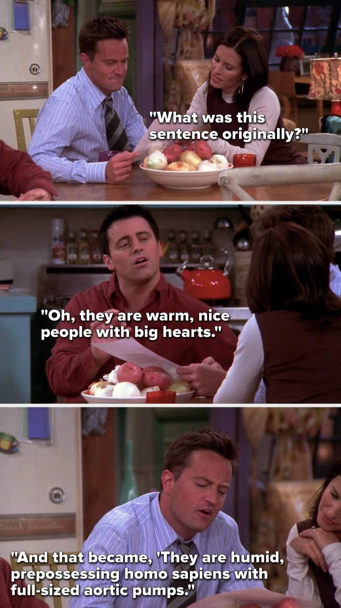

# Technical Writing One

### Participants:

[Pre-class prep, 1 hour](https://developers.google.com/tech-writing/one)

If you haven't done the prep, you can't do this workshop, so go and find something else to get on with.

### Facilitators:

[Facilitator prep, 1 hour](https://developers.google.com/tech-writing/for-instructors/one/instructors-guide)

You need to do the prep before you can run this workshop. Join the [google group](https://developers.google.com/tech-writing/for-instructors/one/instructors-guide#gaining-access-to-the-slide-decks) and get access to [the materials](https://docs.google.com/presentation/d/1XuObj6nQXglpUwaKkCk01hzzvocL7ngxwVP0851IjO8/edit?usp=sharing) by Wednesday before the workshop.

## Learning Objectives

```objectives
- [ ] Develop beginner competency in Markdown
- [ ] Organise a technical document
- [ ] Revise and edit specific parts of a technical document using the key principles of technical writing
```

## Requirements

> Every engineer is also a writer

In this workshop you will practice writing and reviewing technical documentation. This is a critical skill for any engineer. We will use the excellent [Google Technical Writing One](https://developers.google.com/tech-writing/one) workshop materials.

**This workshop will take at least two and a half hours.** Plan to spend a whole morning or whole afternoon on this workshop.

#### Note on AI

Throughout the course, we use Generative AI to help us write and review technical writing. This can be a practical way to get started, but it's important to understand the basic principles and develop your own judgment and clarity. AI frequently generates the _appearance_ of meaning without the substance. This can trick you into thinking your documentation looks good when it doesn't actually convey meaning or help anyone understand anything. Don't be Joey:



## Acceptance Criteria

- We have identified how to address a specific audience
- We have revised and edited a technical document using the key principles of technical writing
- We have successfully explained toothbrushes
