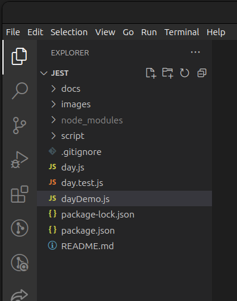
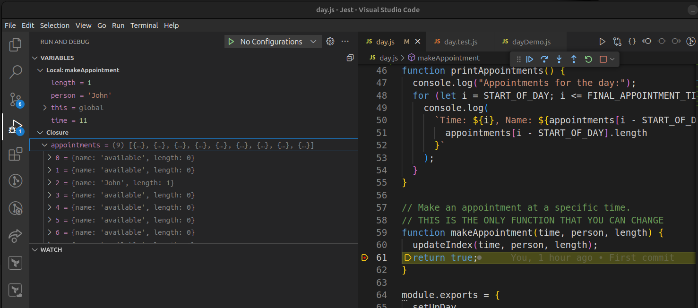

author: Tony Beaumont
summary: Workshop on Jest for testing
id: docs
categories: digital 
environments: Web
status: Published
feedback link: mailto:a.j.beaumont@aston.ac.uk


# Testing with Jest

## Welcome

This workshop looks at writing unit tests in Jest.

### Introduction

This workshop goes with Sprint 3 of Structuring and testing data (See [https://programming.codeyourfuture.io/structuring-data/sprints/3/](https://programming.codeyourfuture.io/structuring-data/sprints/3/)


> aside positive
> ### Important
> 
> You should have completed the prep for this sprint from [https://programming.codeyourfuture.io/structuring-data/sprints/3/prep/](https://programming.codeyourfuture.io/structuring-data/sprints/3/prep/) 

### What you should already know

As a trainee you should:
* be able to write Javascript functions
* be able to write Jest unit tests as described in the prep.

### What you'll learn

* How to write unit tests
* How to design tests
* How to think about the relationship between tests and your code
* How to do Test Driven Development

### What you'll need

You will need a computer with the latest versions of this software installed:

* VS Code
* node ([https://nodejs.org/en/download/package-manager](https://nodejs.org/en/download/package-manager)
* npm

These are the versions I have installed:
```console
$ node --version
v21.2.0
$ npm --version
10.9.0
```


### What you'll do

The following pages will take you through all the steps of the workshop.

* Clone a copy of the workshop from [https://github.com/beaumoaj/jestWorkshop](https://github.com/beaumoaj/jestWorkshop)
* Run the demo
* Run the existing tests
* Read the specification for the `makeAppointment` function
* Write tests and modify to the code to ensure `makeAppointment` meets the specification.

## Where to find the workshop

1.  Open the workshop instructions which can be found here: [https://beaumoaj.github.io/jestWorkshop/#0](https://beaumoaj.github.io/jestWorkshop/#0)
1.  You should `fork` and then `clone` the workshop repository which you will find here: [https://github.com/beaumoaj/jestWorkshop](https://github.com/beaumoaj/jestWorkshop).  Note this repository is currently private, I will make it public at the start of the workshop for you to fork it.

## Exploring the workshop project

Once you have forked the repository and cloned a copy to your computer, open the folder in VS Code.  It should look like this:<br/>



This project contains the following files:

* `day.js` which provides the functionality to store appointments during a given day.  
* `dayDemo.js` contains brief demo of how to use the existing code in `day.js`.
* `day.test.js` contains the beginnings of a set of unit tests for `day.js`.

### Running the code

1.  Open the `package.json` first and look at the `dependencies` (you will see `jest`) and look at the `scripts` - you will see `demo` and `test`.  The `scripts` definitions allow you to run two actions, `demo` and `test` (don't run them yet).
1.  Open the file called `dayTest.js`.  It constains the following code:
	```javascript
	const {
	  setUpDay,
	  makeAppointment,
	  getAppointment,
	  getLengthOfDay,
	  getFirstAppointmentTime,
	  getLastAppointmentTime,
	  printAppointments,
	} = require("./day");

	// The following is just a demo of how to use the functions.
	// Remember to call setUpDay() before making any appointments.
	// If you want to debug a test, you can change the code below to copy the test code.
	console.log("Day Demo.  Setting up an empty day.");
	setUpDay();
	printAppointments();
	console.log("Making an appointment for John at 11am.");
	makeAppointment(11, "John", 1);
	printAppointments();
	```
	At the top of the file we import the required functionality from `day.js`  These are the functions you are allowed to call.  Then we:
	
	* call `setUpDay` to initialise an empty appointment array, 
	* print the appointments from the empty day
	* make a one hour appointment for John at 11
	* print the list of appointments again.  This time we should see the new appointment at 11.

1.  Open a terminal window in the folder and enter:
	
	```console
	npm run demo
	```
	You should see the following output:
	```console
	$ npm run demo

	> jest@1.0.0 demo
	> node dayDemo.js

	Day Demo.  Setting up an empty day.
	Appointments for the day:
	Time: 9, Name: available, Length: 0
	Time: 10, Name: available, Length: 0
	Time: 11, Name: available, Length: 0
	Time: 12, Name: available, Length: 0
	Time: 13, Name: available, Length: 0
	Time: 14, Name: available, Length: 0
	Time: 15, Name: available, Length: 0
	Time: 16, Name: available, Length: 0
	Time: 17, Name: available, Length: 0
	Making an appointment for John at 11am.
	Appointments for the day:
	Time: 9, Name: available, Length: 0
	Time: 10, Name: available, Length: 0
	Time: 11, Name: John, Length: 1
	Time: 12, Name: available, Length: 0
	Time: 13, Name: available, Length: 0
	Time: 14, Name: available, Length: 0
	Time: 15, Name: available, Length: 0
	Time: 16, Name: available, Length: 0
	Time: 17, Name: available, Length: 0
	```
	
	Check the output is what you expected given the code in `dayDemo.js`.

## What does `makeAppointment` currently do?

Imagine that you have been asked to implement the function called `makeAppointment`.  The starting code for this function can be found near the bottom of `day.js` and it's current implementation is:

```javascript
// Make an appointment at a specific time.
// THIS IS THE ONLY FUNCTION THAT YOU CAN CHANGE
function makeAppointment(time, person, length) {
  updateIndex(time, person, length);
  return true;
}
```

1.  Don't change any code yet but open `day.js` and find the `makeAppointment` function.  Also find the function called `updateIndex` which is the function that changes the contents of the array containing all of the appointments in the day.
	> aside positive
	> 
	> Note that we saw that for an empty appointment slot, the name was `available` and the length was `0`.  To set up an empty day, we initialise every index in the array to the following value:
	> ```javascript
	> { name: "available", length: 0 }
	> ```
	> Once an appointment is made, the `name` property should contain the name of the person the appoinment is with.  The `length` property should contain the length of the appointment.

If you were to debug the code with a break point at the end of `makeAppointment` you will see the following:



Appointments made for 9am are stored in index 0, appointments for 10am are stored in index 1, appointments for 11am are stored in index 2.

Note that after we run the `dayDemo` and set an appointment for John at 11, **index 2** of the appointments array has been changed to:
```javascript
{ name: "John", length: 1 }
```
You can also see the values of the parameters `length`, `person` and `time` in the debugger.

The code for `makeAppointment` is only the starting point for the function.  Before we can change anything, we need to know the specification for that function.

## The specification for `makeAppointment`

Here is the **specification** (ie **the rules**) for the `makeAppointment` function.  The specification tells us how the function should work.

* The `makeAppointment` function will `return true` when the appointment was made successfully and `return false` when the appointment could not be made.  There should be no exceptions generated.
* The earliest time an appointment can be made is 9 (meaning 9:00).
* The latest time an appointment can be made is 17 (meaning 17:00).
* The length of an appountment will be provided in hours.  A value of 1 means a one hour appointment, a value of 2 means a two hour appointment, and so on.
* An appointment can only be successfully booked if **all** the time slots it will take up represent a valid time and contain `{ name: "available", ...}`.  The value of `length` is not relevant when the value of `name` is `available`.
	For example, if we wanted to make a 3 hour appointment for John, starting at 11, the result of printing the day should look like this:
	```console
	Making a three hour appointment for John at 11am.
	Appointments for the day:
	Time: 9, Name: available, Length: 0
	Time: 10, Name: available, Length: 0
	Time: 11, Name: John, Length: 3
	Time: 12, Name: John, Length: 3
	Time: 13, Name: John, Length: 3
	Time: 14, Name: available, Length: 0
	Time: 15, Name: available, Length: 0
	Time: 16, Name: available, Length: 0
	Time: 17, Name: available, Length: 0
	```
*  No appointments may continue after 18:00, so you can only set a one hour appointment to start at 17:00.

1.  Take some time to look at these rules.  
1. Write down **five** different scenarios for making an appointment that should `return true` (ie they are allowed)
1. Write down **five** different scenarios for making an appointment that should `return false` (ie they should not be allowed).

## Test Driven Development

The philosophy behind Test Driven Development (aka TDD) is that we should write a test first to check the functionality that we are about to write.  We run the test and see that it fails.  Then we implement the functionality and re-run the test and hopefully see that it passes.

1.  Open the file called `day.test.js` and have a look at the existing tests.  There are three of them.  Read the tests and try to understand what they do (**do not run the tests** yet).
2.  Do you understand what each of the three tests are testing for?  If not ask a question.

A good test should should have **three parts**:
*  **First:** Set everything up ready for the test
*  **Second:** Perform the action we are testing
*  **Third:** Check the results of the action to see that everything we `expect` to have happened has indeed happened.

### Example: testing that `setUpDay` works correctly

Here is the code to test `setUpDay`:
```javascript
// test that all the appointments on an empty day are available
test("empty day", () => {
  // nothing to set up
  // perform the action we are testing
  setUpDay();
  // check the results are as we expected
  const start = getFirstAppointmentTime();
  const length = getLengthOfDay();
  for (let time = start; time < length; time++) {
    expect(getAppointment(time).name).toBe("available");
  }
});
```

Here there is nothing to set up.  The **action** is that we call the function `setUpDay`.  Checking requires we look at the array to see that `name` property has the value `available` for each hour of the day.

### Example: testing we can make an appointment at 9:00

Here is the test to make an appointment at the start of the day (at 9:00).
```javascript
// test that we can make an appointment at the start of an empty day
test("Make Appointment at start of day", () => {
  // set up everything ready for the test
  setUpDay();
  const time = getFirstAppointmentTime();
  // perform the action
  const result = makeAppointment(time, "John", 1);
  // check the results are as expected
  expect(result).toBe(true);
  expect(getAppointment(time).name).toBe("John");
  expect(getAppointment(time).length).toBe(1);
});
```
Here there are two things to set up, first we need to call `setUpDay` to ensure the day's appointments are all available, and then we find the time of the first appointment of the day.  Next we perform the action which is to make the appointment and get the returned `result`.  Finally we check that the returned result was `true`, the name associated with the assigned appointment is `John` and the length associated with the assigned appointment is `1`.

### Running the tests

1.  Run the tests by typing the following into the terminal window:
	```console
	npm run test
	```
1.  Which tests pass and which test fails?
1.  Identify the failed test, where is it failing and what is going wrong. (**do not change any code at this time**)
1.  Explain what is causing the test to fail.

### Discussion

1.  At this point we will have a discussion to check everyone is following and understands the tests.

### Fixing the failed test

1.  Edit the code in `makeAppointment` to ensure that the method returns `false` as described in the specification.  **Do not modify any existing function except for `makeAppointment`**.
1.  Rerun the tests and ensure that all tests pass.

## Write some more tests.

You should work in pairs to complete the following steps.  If you finish this step and have time to spare, repeat the steps and write tests for other scenarios.

1.  Pick one of your five scenarios that should cause `makeAppointment` to return `true` and write a test to ensure that everything it needs to do has been done correctly.
1.  Run the test and see it fail
1.  Write the code to implement your scenario
1.  Rerun the tests and ensure it passes **before** you continue
1.  Pick one of your five scenarios that should cause `makeAppointment` to return `false` and write a test to ensure that nothing has changed in the appointment diary and that the returned value is `false`.
1.  Run the test and see it fail
1.  Write the code to implement your scenario
1.  Rerun the tests and ensure it passes **before** you continue

> aside positive
> Note that it is possible that the test passes without having to write any new code.  This just means that the existing functionality includes the scenario you just wrote a test for.  Pick another scenario and write a test for it.

> aside positive
> Remember that every good test should should have **three parts**:
> *  **First:** Set everything up ready for the test
> *  **Second:** Perform the action we are testing
> *  **Third:** Check the results of the action to see that everything we `expect` to have happened has indeed happened.


## Summary

* We engaged in TDD and wrote tests **before** writing the required functionality
* We looked at some existing tests and how they worked
* We looked at fixing the implementation to make a failed test pass.
* We discovered that we may need to write a lot of tests to cover all possible scenarios.
